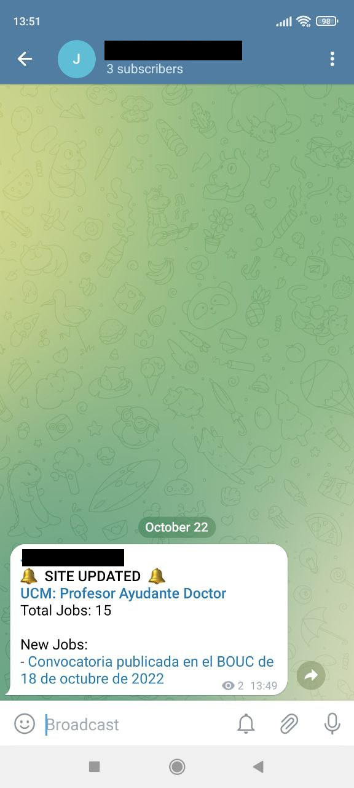
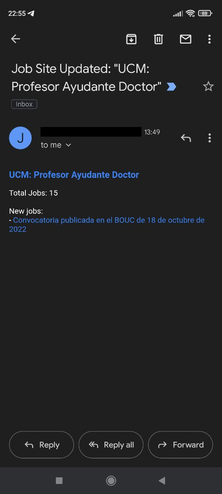

# Job Alerts

### Context

Small demo application that checks websites periodically so that it can alert when the content has been updated.

It extracts information about job openings from the configured websites and sends notifications to
visualise the information in a convenient and comfortable way.

It was originally conceived to alert about new teaching opportunities in different Spanish universities, however it can be used to notify about updates from any kind of website.

### Tech

The project is built using a reactive and non-blocking tech stack for scheduling tasks, processing HTTP requests and executing database queries.

- Spring Webflux

- Project Reactor

- R2DBC

### Crawler

Jobs are parsed using Jsoup which navigates the DOM and fetches the required elements.

In order to implement a more advanced parsing strategy we can extend the `JobParsingStrategy` class and enable a more sophisticated interaction including clicking or JS support. For that 
a more specialized tool such as Selenium with a headless browser can be used.

### Alerts

At the moment Telegram (Bot API) and Email (SMTP) alerts are supported.

&nbsp;&nbsp;&nbsp;&nbsp;&nbsp;