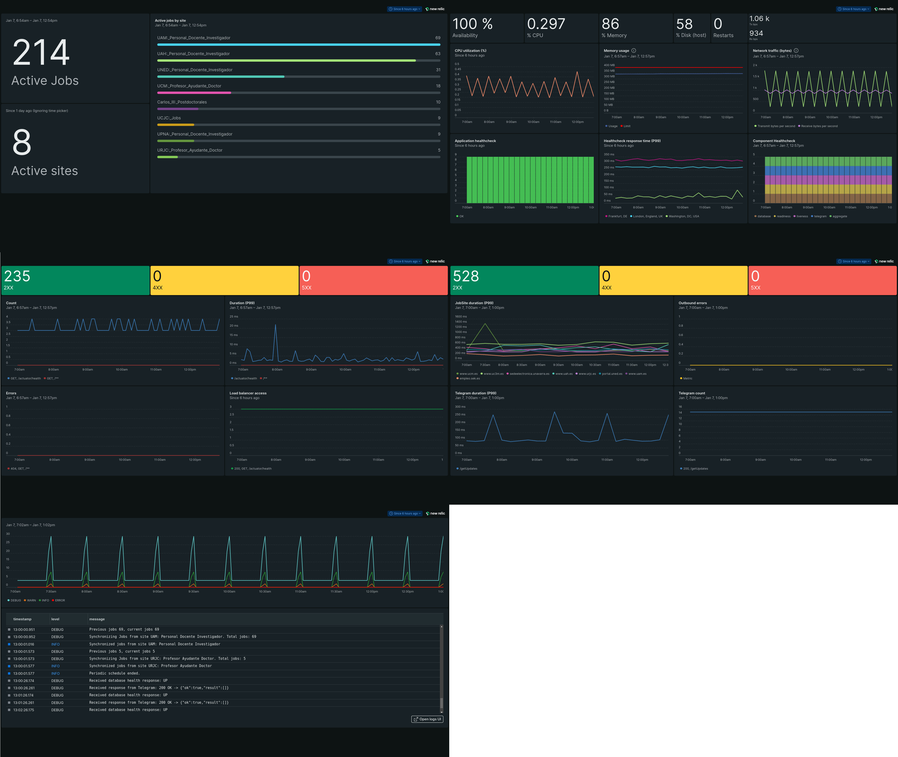

# Job Alerts

### Context

Small demo application that checks websites periodically so that it can alert when the content has been updated.

It extracts information about job openings from the configured websites and sends notifications to
visualise the information in a convenient and comfortable way.

It was originally conceived to alert about new teaching opportunities in different Spanish universities, however it can be used to notify about updates from any kind of website.

### Tech

The project is built using a reactive and non-blocking tech stack for scheduling tasks, processing HTTP requests and executing database queries.

- Spring Webflux

- Project Reactor

- R2DBC

### Crawler

Jobs are parsed using Jsoup which navigates the DOM and fetches the required elements.

For the more advanced websites, Selenium is integrated in order to provide JS rendering and interactive actions.

The `JobParsingStrategy` interface can be extended to provide alternate parsing methods.

### Alerts

At the moment Telegram (Bot API) and Email (SMTP) alerts are supported, although other notification means can be easily added by extending the interfaces in the `notification` package. 

&nbsp;&nbsp;&nbsp;&nbsp;&nbsp;

### Monitoring

NewRelic is integrated through the Java Agent, Micrometer and the Infrastructure Agent as a POC to get familiarized with the tool.

It provides visibility of application, system and business metrics as well as a centralised place for the logs.

Alerts are also set to notify about certain scenarios.

